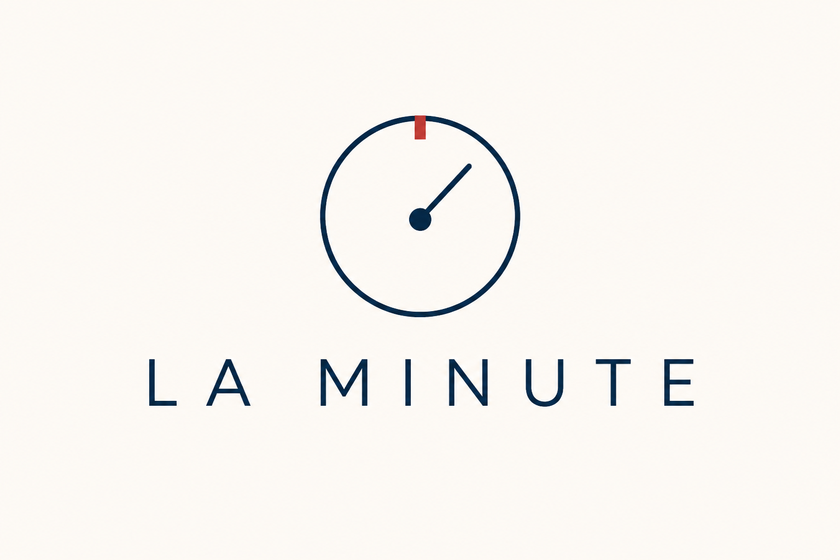

<p align="center">
  
</p>

**La Minute** transforme vos réunions en comptes-rendus structurés : synthèse, décisions et actions.

Enregistrez ou importez un audio, lancez le traitement, et consultez le résultat. Les réunions restent stockées sur votre ordinateur ; le traitement dépend du fournisseur IA choisi.

[](https://github.com/juleshrd/laminute/actions/workflows/ci.yml)

## Télécharger et installer

Téléchargez la [dernière version](https://github.com/juleshrd/laminute/releases/latest) pour votre ordinateur :

| Système | Fichier             |
| ------- | ------------------- |
| Windows | Installateur `.exe` |
| macOS   | Fichier `.dmg`      |
| Linux   | Fichier `.AppImage` |

Installez, puis ouvrez **La Minute**.

- **macOS** : si macOS bloque l’ouverture, clic droit sur l’app → **Ouvrir**.
- **Windows** : si SmartScreen s’affiche, choisissez **Exécuter quand même**.

Quand une nouvelle version est disponible, l’app vous propose la mise à jour.

## Configuration recommandée (Mistral)

C’est le parcours le plus simple pour démarrer.

1. Créez un compte (ou connectez-vous) sur [console.mistral.ai](https://console.mistral.ai/).
2. Créez une **clé API**, puis copiez-la.
3. Dans La Minute, ouvrez **Réglages**.
4. Choisissez **Mistral AI**, collez la clé, enregistrez, puis **Validez**.

Votre clé est stockée dans le trousseau de votre ordinateur (pas dans les exports de réunions).

## Premier usage

1. Importez un fichier **MP3**, ou lancez un **enregistrement**.
2. Donnez un titre à la réunion.
3. Cliquez sur **Traiter** : transcription puis compte-rendu.
4. Retrouvez le résultat dans l’historique.

## Autres fournisseurs IA

### OpenAI

1. Créez une clé sur [platform.openai.com](https://platform.openai.com/api-keys).
2. Dans **Réglages**, choisissez **OpenAI**, collez la clé, enregistrez et validez.

OpenAI gère la transcription audio et le compte-rendu.

### Ollama (tout local)

Utile si vous préférez ne rien envoyer dans le cloud.

1. Installez [Ollama](https://ollama.com/) et lancez-le.
2. Téléchargez un modèle, par exemple : `ollama pull llama3.2`
3. Dans **Réglages**, choisissez **Ollama**.
4. Laissez l’adresse par défaut `http://127.0.0.1:11434` (sauf config particulière), puis validez.

**Limite** : Ollama ne transcrit pas l’audio. Collez le texte de la réunion dans l’app pour générer le compte-rendu.

### Comparatif rapide

| Fournisseur          | Transcription audio | Compte-rendu | Où ça tourne      |
| -------------------- | ------------------- | ------------ | ----------------- |
| Mistral (recommandé) | Oui                 | Oui          | Cloud (votre clé) |
| OpenAI               | Oui                 | Oui          | Cloud (votre clé) |
| Ollama               | Non                 | Oui          | Votre ordinateur  |

## Confidentialité

Vos réunions restent sur votre machine. Aucune télémétrie n’est envoyée aux développeurs. Si vous utilisez Mistral ou OpenAI, seuls l’audio (transcription) et/ou le texte (compte-rendu) partent vers le fournisseur que vous avez choisi.

Détails : [PRIVACY.md](PRIVACY.md).

## Pour les développeurs

```bash
npm install
npm run dev
```

Validation complète avant une PR (équivalent CI) :

```bash
npm run check:ci
```

### Performance — recherche historique

La recherche texte sur l'historique utilise un index SQLite FTS5 (tokenizer trigram). Pour mesurer les latences sur un jeu de données synthétique (1 000 réunions) :

```bash
cd src-tauri && cargo run --example bench_search --release
```

Prérequis, structure du dépôt et contributions : [CONTRIBUTING.md](CONTRIBUTING.md).

## Licence

GPL-3.0 — voir [LICENSE](LICENSE).
